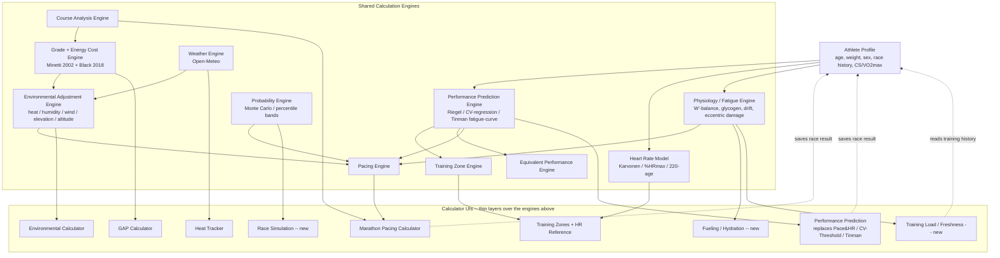

# Haarchive Calculator Ecosystem — Design Review

Status: research and recommendations only. Nothing in this document has been implemented. Every factual claim below is grounded in the current codebase (file:line citations preserved from the underlying research) as of this audit, not assumption.

## Table of contents

1. Executive summary
2. Current strengths
3. Weaknesses
4. Calculator inventory
5. Overlapping and duplicate logic
6. Consolidation — engaging the user's own proposals
7. Missing capabilities
8. Shared calculation engines
9. Scientific accuracy review
10. Educational value review
11. UX review
12. Information architecture recommendations
13. Athlete profile architecture
14. The Haarchive Calculation Engine (proposed architecture)
15. Roadmap (short / medium / long-term)
16. Refactoring priorities

---

## 1. Executive summary

Haarchive's ten tools are, individually, unusually good. They cite real papers (Minetti 2002, Mantzios 2022, Black 2018, Da Silva 2022, Weltman 1990, meta-analytic HR data), they show uncertainty instead of false precision, and they share a consistent visual and interaction language. That's rare — most running calculators on the internet are algebra dressed up as science.

But the collection behaves like ten islands, not a platform. No calculator knows anything about the runner who just used a different calculator sixty seconds ago. A user can enter their 5K time into the Threshold Calculator, get a critical speed, then immediately open the Marathon Pacing Calculator and be asked to re-enter that same 5K time from scratch. Worse: the database already has a well-designed `athlete_profiles` table with ~24 fields (age, weight, sex, mileage, training days, equipment, location) sitting almost entirely unused — only 2 of those fields are read or written anywhere in the app (`src/app/(app)/(protected)/plan/actions.ts:79-83`). This isn't a data-modeling problem to solve from scratch; it's an activation problem.

There are also at least two genuine numeric inconsistencies between calculators that claim to answer the same question, not just style debt: `pace-calculator.tsx`'s Karvonen heart-rate formula adds a +3 bpm adjustment for female users that `hr-threshold-calculator.tsx`'s otherwise-identical formula doesn't have (`src/components/pace-calculator.tsx:274-281` vs `src/components/hr-threshold-calculator.tsx:39-42`), and the mile-in-meters constant exists as both `1609.344` (10+ locations) and a truncated `1609.34` (5 other locations: `src/lib/format.ts:44`, `src/lib/ai/prompts.ts:102`, `src/lib/coaching-engine/describe-prescription.ts:7`, `src/lib/coaching-engine/pace-zones.ts:5`, `src/components/workout-summary-line.tsx:63`). For a site whose entire brand is scientific rigor, two calculators quietly disagreeing on the same input is a credibility risk, not a rounding error.

The good news: the newest tool (Marathon Pacing Calculator) already demonstrates the right architecture. It composes a course-analysis layer, a physiology layer, a strategy layer, and reuses the site's existing environmental-adjustment engines rather than reinventing them. The environmental engines themselves (`src/lib/environmental/*`, built around a shared `AdjustmentEngine<T>` interface) are a second example of the same pattern working correctly today, powering both the Environmental Performance Calculator and (indirectly) the Marathon Pacing Calculator. The task ahead isn't inventing a new architecture — it's retrofitting the pattern the team has already twice proven works, backward onto the other eight tools, and building the athlete-profile plumbing that lets all of them talk to each other.

## 2. Current strengths

- **Real physiology, not folklore.** Minetti's quintic grade-cost polynomial, Mantzios's marathon heat/humidity model, Black's flat-ground cost regression, Da Silva's wind-to-metabolic-cost conversion, a random-effects meta-analysis for LT1/LT2 HR ranges — every non-trivial model cites its source in a "Behind the calculator" section.
- **Honest uncertainty.** The Threshold/CV/VO2max Calculator returns percentile ranges, not one number, and explains why two runners with the same race time can have different threshold paces. The HR Reference tool lets you pick your confidence width and explicitly flags that its HR-reserve arm rests on a single 1990 study. This is a real differentiator against typical calculator sites that report point estimates as if they were exact.
- **A working shared-engine pattern already exists.** `src/lib/environmental/` implements heat, humidity, wind, and elevation as independent `AdjustmentEngine<T>` implementations combined via `combine.ts` — and it's genuinely reused, not just internally modular: Marathon Pacing Calculator's `mile-cost-model.ts` calls the same `heatEngine`/`humidityEngine` the Environmental Performance Calculator uses. This is proof the "shared engine" vision in this audit is achievable, because it's already been done once.
- **Consistent product feel despite disconnected data.** `tool-styles.ts`, `form-styles.ts`, `usePersistedField`/`usePersistedJSON`, and `SaveCalculationButton` give every tool the same look, input behavior, and save affordance. A user can't tell from the UI alone that these are ten unrelated codebases wearing the same outfit.
- **A real, if underused, persistence layer already exists.** `saved_calculations` (arbitrary `input_json`/`output_json` per calculator), `goals`, and `race_results` are live tables with working write paths from the dashboard onboarding flow.

## 3. Weaknesses

- **Zero cross-tool state.** Every tool's persisted state is local-storage-keyed to itself. Nothing reads from `athlete_profiles`, `goals`, or `race_results`, and nothing reads a previous calculator's output as an input.
- **At least one confirmed numeric bug, not a style issue.** The Karvonen female-adjustment inconsistency above means two calculators give different heart-rate targets for the same nominal inputs.
- **Silent constant drift.** `1609.344` vs `1609.34` is the exact class of bug this project has already found and fixed three separate times this session inside the Marathon Pacing Calculator alone (durability doing nothing, wind doing nothing on the flat-course fallback, the temperature scenario reading a stale hidden value) — a control or calculation quietly not doing what it claims. It exists elsewhere in the codebase, unaudited, right now.
- **A model with no science standing alongside real science.** Race Pace Calculator is pure `distance = speed × time` algebra (`src/lib/race-pace-math.ts:1-13`) — a legitimate utility, but presented as an equally-weighted top-level "calculator" next to Minetti/Mantzios-backed tools dilutes the collection's own credibility signal, and it's the only tool with no methodology section at all.
- **The input form is reimplemented at least six times.** Distance-picker + time-input UI exists independently in Pace & HR, CV-Threshold, Race Pace, Tinman, GAP, and Pace Percent, each with its own state shape and its own subtly different distance catalog handling (see §5).
- **`saved_calculations` is a dead end.** Results go in as opaque JSON and come back out only as a flat five-item "recent calculations" list on the dashboard (`src/app/(app)/(protected)/dashboard/page.tsx:111-116, 374-403`). Nothing round-trips into a future calculation.
- **The athlete-profile table is 92% dormant.** Of `athlete_profiles`'s ~24 columns, only `current_weekly_mileage` and `running_days_per_week` are ever read or written, both solely to prefill the training-plan generator form.
- **Coaches can't see athlete fitness data.** The coach roster (`src/app/(app)/(protected)/coach/roster/page.tsx:21-31`) and athlete detail view join only on `display_name` — no race times, no CS, no goal race, even where that data exists in `goals`/`race_results`.

## 4. Calculator inventory

| Tool | Core inputs | Core outputs | Model / source | Lib dependencies |
|---|---|---|---|---|
| Heat Tracker | Location only | Live WBGT, zone, 48h outlook | ACSM WBGT approximation (Australian BoM formula) | `heat-physics.ts`, `geocode` |
| Pace & Heart Rate Calculator | Distance, time, course type, age, resting/max HR, sex | Equivalent races, training paces, Karvonen HR zones | Riegel `T2=T1×(D2/D1)^1.06`; 220−age; MAF; Karvonen (local, has the +3bpm bug) | `race-distances.ts`, `running-format.ts` |
| Environmental Performance Calculator | Distance, weight, route/weather (2 condition sets), elevation | Equivalent time ± range, per-factor breakdown | Mantzios 2022 (heat/humidity), Black 2018 + Da Silva 2022 (wind), Minetti 2002 (elevation, via coarse total-gain/loss assumption) | `environmental/*` engines, `wind-physics.ts`, `route-import/*` |
| GAP Calculator | Pace or grade/vertical speed | Equivalent flat/graded pace | Minetti 2002 quintic polynomial (direct) | `grade-pace-physics.ts` |
| Pace Percent Calculator | Reference pace, percent, basis | Workout pace | Canova % of pace / % of speed convention | `pace-percent-math.ts` |
| Threshold/CV/VO2max Calculator | Distance (800m–10K), time, age | Threshold/CV/VO2max paces ± percentile range | Quantile-regression critical-speed model, fit on ~8,600 real performances | `cv-threshold-math.ts` |
| Race Pace Calculator | Distance + time, or pace | Converted pace or time | None — pure algebra | `race-pace-math.ts`, `race-distances.ts` |
| LT1 & LT2 HR Reference | Age, max/resting HR, basis, confidence width | LT1/LT2 BPM + % ranges | Random-effects meta-analysis (ported statistics); HRR arm is a single 1990 study (Weltman) | `hr-threshold-reference.ts` |
| Tinman Running Calculator | Distance, time, gender | Rating, 30 equivalent races, 13-zone training paces | Independently reverse-engineered distance-based fatigue curve + log-corrected vVO2max (explicitly not VDOT) | `tinman-calculator-math.ts` |
| Marathon Pacing Calculator | Fitness (via CV-threshold model), goal time, course, weather, strategy, risk | Mile-by-mile pace, fatigue, fueling | Composes Minetti, wind physics, heat/humidity engines, and a purpose-built physiology model | `marathon-pacing/*`, `environmental/*`, `grade-pace-physics.ts`, `wind-physics.ts` |

No standalone "Wind Calculator" exists — a comment in `src/components/location-search-field.tsx:16-17` still references one, but it was never built or was removed; this is a documentation artifact, not a missing feature. Training Plans is a separate static content hub (5 tracks × 2 durations, sourced from a book attribution), not a `category: "tools"` calculator, and has no inputs or save behavior.

## 5. Overlapping and duplicate logic

**Confirmed inconsistency (fix, don't just consolidate):**
Karvonen HR-zone math exists independently in `pace-calculator.tsx:274-281` (`karvonenAt`, adds `femaleAdj = isFemale ? 3 : 0`) and `hr-threshold-calculator.tsx:39-42` (`bpmFromPercent`, no such term). Same formula family, different output for the same female-runner inputs. Neither imports from a shared HR-model file; both are component-local.

**Duplicated but currently consistent (consolidate for maintainability, not correctness):**
- Pace↔speed↔time conversion: independently implemented in `race-pace-math.ts:7-13`, `pace-percent-math.ts:91-100`, and inline in both `cv-threshold-calculator.tsx:91-93` and `gap-calculator.tsx:123,158`. Notably, `cv-threshold-calculator.tsx` already imports `PACE_UNIT_METERS` from `pace-percent-math.ts` (line 19) for one purpose but defines its own separate `{m, mi, km}` map (line 57) for another — i.e., even where sharing exists in this codebase, it isn't applied consistently within the same file.
- 220−age max-HR estimate: independently written in `pace-calculator.tsx:501` and `hr-threshold-calculator.tsx:128`.
- Distance constants: `1609.344` appears as an independent literal in 10+ files rather than importing `race-distances.ts`'s `MILE_METERS`; a *different*, truncated `1609.34` appears in 5 files outside the calculators entirely (`format.ts`, `ai/prompts.ts`, two `coaching-engine/` files, `workout-summary-line.tsx`). `21097.5` (half marathon) appears once correctly derived (`race-distances.ts:49`, `MARATHON_METERS / 2`) and twice as an independent literal.
- Grade-adjusted pace: two live models simultaneously. `grade-pace-physics.ts` (Minetti 2002, exact grade) backs both GAP Calculator and Marathon Pacing Calculator. `environmental/elevation-engine.ts` uses a coarser, self-documented-as-provisional assumed-uniform-grade approach from total gain/loss alone — its own code comments already flag this as a stand-in for when real per-point grade data isn't available. Marathon Pacing Calculator proves the better model is usable the moment route data exists; Environmental Calculator's "predict" mode with an uploaded route should use it too.
- Energy cost curves: `grade-pace-physics.ts`'s own header comment explicitly documents that its flat-ground cost curve (Black et al. 2018, fit via GAM) is deliberately *not* unified with `wind-physics.ts`'s `treadmillCostWPerKg` (a different, hand-picked quadratic), specifically to avoid silently shifting the already-shipped Wind Calculator's numbers. This is a known, intentional, currently-live divergence in the codebase's own words — the clearest evidence in the whole audit that an "Energy Cost Model" engine is needed, because the team already had to consciously choose not to unify it once.

**Deliberately not duplicated (correctly kept separate — don't consolidate):**
VO2max estimation exists in two genuinely different forms: the CV-Threshold Calculator's quantile-regression surface and Tinman's log-corrected vVO2max from 3000m-equivalent pace. Tinman's own methodology section states it was benchmarked against VDOT and found "roughly 500x worse" a fit — these are different methodologies answering a related but distinct question, not copies of each other. The problem isn't that two models exist; it's that nothing tells the user *why* they might get two different numbers from two differently-named tools (see §6).

**Unconfirmed, flagged for follow-up:** the dashboard's `predictRaceTime()` (`src/app/(app)/(protected)/dashboard/recent-fitness.ts`) may be a fourth independent race-time-prediction implementation. This wasn't fully traced in this audit and should be checked before the Performance Prediction consolidation in §6 is scoped.

## 6. Consolidation — engaging the user's own proposals

**"Should Race Pace Calculator become a tab inside another calculator?"** Yes, but reframe it: it's infrastructure, not a destination. It's the only tool with no model and no methodology section — a tell that it's a utility wearing a calculator's clothes. Recommend folding it into a persistent "convert this pace" affordance available inline from Pace & HR, CV-Threshold, Tinman, and Marathon Pacing (every one of which already produces a pace or time worth converting), rather than a page navigation away.

**"Should GAP live inside the Environmental Calculator?"** Partial disagreement. GAP answers a fast, narrow, in-the-moment question ("what's my tempo pace worth on this hill") with almost no setup. Environmental Calculator is a 20+-field instrument (weight, route import, dual weather condition sets, workout type). Burying GAP inside it would slow down GAP's common case to consolidate functionality that isn't actually needed together most of the time. Better: unify the *engine* (both should run on `grade-pace-physics.ts`; today they already do), not the UI. Keep GAP standalone as the fast tool; let Environmental Calculator's route-based elevation math upgrade to the same engine when real grade data is available.

**"Should Threshold Calculator become part of the Performance Calculator?"** Reframe as: Pace & HR's Riegel-based prediction and CV-Threshold's statistical model are two different, competing answers to "what training paces should I run" — currently presented as two differently-named, easy-to-confuse tools rather than two modes of one tool. Recommend merging into a single **Performance Prediction** tool with a model selector (simple/Riegel, statistical/critical-speed, and — see below — Tinman's fatigue-curve model), shown side by side with an explicit "these use different methods and may disagree because..." explanation when they diverge. This directly answers the brief's own question about blending multiple published models: blend the *presentation*, not the *numbers* — averaging outputs from methodologically different models would manufacture false agreement between quantities that aren't actually measuring the same thing.

**"Should Tinman Calculator become an optional prediction model rather than its own page?"** Strongly agree, and it's the same consolidation as above by another name. Pace & HR, CV-Threshold, and Tinman are three separate top-level pages solving the identical user problem — "predict my fitness and training paces from one race result" — with three different models. That's three calculators for one job. Fold all three into the Performance Prediction tool's model selector.

**"Should Pace Percent be integrated into workout generation?"** Partial agree. Its actual unique function — converting a pace by percent-of-pace or percent-of-speed — is a small, genuinely reusable primitive that belongs inline wherever a pace is displayed (training-plan workout cards, Performance Prediction's training-pace output). But it also serves a standalone use case (a coach converting a pace they read in a book, with no athlete context at all), so it shouldn't disappear as a page — it should *also* become an inline mini-widget everywhere else.

**"Should Marathon Pacing consume outputs from every other calculator?"** Yes — this is the correct end state, and it's already halfway there: it already derives critical speed/VO2max via the same `cv-threshold-math.ts` model the standalone Threshold Calculator uses. The gap isn't the model, it's the data entry: it re-collects age/race-time/weight from scratch through its own form instead of reading a completed Performance Prediction session or an `athlete_profiles` row. This is the single clearest, most concrete "flow" fix available in the whole ecosystem, because the hard part (the shared model) is already built.

## 7. Missing capabilities

Framed by what already exists vs. what's genuinely new, per the brief's instruction to explain integration, not just list ideas:

- **Critical Power/Speed** — not missing. The Threshold/CV/VO2max Calculator already is this.
- **Race Prediction** — not missing, over-provided (three independent implementations; see §6).
- **Fueling** — partially exists (`marathon-pacing/fueling-engine.ts`), scoped only to marathon race day. Generalize it into a standalone Fueling/Hydration tool for long training runs by extracting it as a shared engine rather than a marathon-pacing-only module.
- **Fatigue / Durability** — partially exists. `marathon-pacing/physiology-engine.ts` (W′-balance, glycogen, cardiac drift, eccentric damage) is the only real fatigue model on the site, currently trapped inside one calculator's race-day context. Extracting it into a race-agnostic engine is the highest-leverage single refactor identified in this audit — it would immediately unlock a daily training-load/freshness tool with no new physiology work.
- **Performance Trends** — genuinely missing, but near-zero cost to build: `race_results` already exists and is already collected via the dashboard onboarding flow, but is never visualized as a fitness-over-time chart. This is buildable today with zero new data collection.
- **Injury Risk** — genuinely missing, and buildable today: an acute:chronic workload ratio (ACWR) tool needs only `workout_completions`, which already exists from Strava sync.
- **Aerobic Decoupling** — genuinely missing, low-lift: Strava route import already fetches `latlng`/`altitude`/`time` streams (`src/lib/strava/client.ts:72`); adding `heartrate` to that same streams call is a small extension, not new plumbing.
- **Altitude/atmosphere** — appears unimplemented (elevation-engine.ts handles course *grade*, not barometric-pressure performance cost) and should verify against the marathon-pacing physiology brief's own mention of "altitude acclimatization" as a training input. Real, well-documented physiology exists (roughly 1–2% VO2max reduction per 300m above ~1,500m) and would naturally slot in as a fifth `AdjustmentEngine`.
- **Sweat Rate/Hydration** — genuinely missing; pairs directly with Fueling (pre/post-run weight delta feeds fluid targets currently generic-per-hour rather than individualized).
- **Environmental Forecasting** — partially exists: Heat Tracker already has a 48-hour WBGT outlook. That forecast-fetching should feed Marathon Pacing Calculator's "what's forecast for race day" instead of requiring manual weather entry there.
- **Race Simulation / Confidence Prediction** — genuinely new, and already flagged as a deferred roadmap item in the Marathon Pacing Calculator's own design document. Now buildable for real: it would sample uncertainty from both the CV-Threshold model's percentile bands and the physiology engine's fatigue states together, which no other public marathon-pacing tool does. Worth treating as a genuine platform differentiator, not a checkbox feature.
- **Running Economy** — aspirational, needs submaximal test data most users don't have. Low priority.
- **Workout Design** — partially exists inside `coaching-engine/` for enrolled training-plan users; a standalone "build me a workout" tool for non-enrolled users is a reasonable medium-term extension, reusing the Performance Prediction and Pace Percent engines for the actual numbers.
- **Recovery** (sleep/HRV) — genuinely missing and requires new data collection the app doesn't currently do (no wearable integration beyond Strava activities). Lowest priority until that data source exists.

## 8. Shared calculation engines

| Proposed engine | Current state | Recommendation |
|---|---|---|
| Environmental Adjustment Engine | **Exists** (`environmental/*`, `AdjustmentEngine<T>`) | Add a 5th member (altitude/atmosphere); broaden reuse into Marathon Pacing's weather auto-fetch |
| Grade/Energy Cost Engine | **Exists** (`grade-pace-physics.ts`, Minetti) | Retire `elevation-engine.ts`'s coarse model wherever real grade data exists; keep it explicitly as the no-route-data fallback |
| Weather Engine | **Exists** (`fetch-weather-conditions.ts`, Open-Meteo) | Already shared by Environmental Calculator; wire Marathon Pacing Calculator to it (currently manual-entry only) |
| Course Analysis Engine | **Exists** (`marathon-pacing/course-analysis.ts`) | Currently single-consumer; reuse for Environmental Calculator's route-based elevation once uploaded |
| Pacing Engine | **Exists** (`marathon-pacing/split-generator.ts`, `strategy-engine.ts`) | Single-consumer; evaluate whether `coaching-engine/pace-zones.ts` should consume it instead of its own pace math |
| Physiology / Fatigue Engine | **Exists but race-locked** (`marathon-pacing/physiology-engine.ts`) | Extract to be race-agnostic; back a training-load/freshness tool |
| Performance Prediction Engine | **Net new** (unifying layer) | Wrap `race-pace-math.ts` (Riegel), `cv-threshold-math.ts` (quantile regression), `tinman-calculator-math.ts` (fatigue curve) behind one model-selectable interface |
| Training Zone Engine | **Fragmented** — 4 independent zone systems (Pace & HR's tables, CV-Threshold's outputs, Tinman's 13-zone grid, HR Reference's ranges) | Share one "fitness anchor in, zone table out" interface even where the underlying fitness models differ |
| Heart Rate Model | **Duplicated and inconsistent** (§5) | Unify Karvonen + %HRmax + 220−age into one lib file; fixes the correctness bug as a side effect |
| Equivalent Performance Engine | **Fragmented** — `combine.ts`'s equivalent-time logic and Tinman's `predictEquivalentRaceTimes` solve related problems independently | Share one "fitness anchor + target distance → predicted time" interface |
| Probability Engine | **Net new** (percentile machinery in `cv-threshold-math.ts` generalizes) | Powers race-simulation/confidence-prediction work |

## 9. Scientific accuracy review

- **Fix the Karvonen inconsistency first** — this is a correctness bug, not a style preference, and directly touches the site's credibility.
- **Surface model disagreement explicitly** wherever two tools estimate the same physiological quantity by different methods (VO2max via CV-Threshold vs. Tinman), rather than letting a curious user stumble onto two different numbers with no explanation.
- **Don't blend independently-validated models into one number** unless they're genuinely noisy measurements of the same target — the brief's own Tinman methodology explicitly states it is *not* measuring the same thing as VDOT. Comparison-with-explanation is the scientifically honest version of "blending" here, not averaging.
- **Extend uncertainty to tools that currently show bare point estimates** despite resting on regression models with known residual error already computed during this project's own reverse-engineering work (GAP Calculator's Minetti/Black-based estimate, in particular, could show a real ± band instead of one number).
- **Sweep for the `1609.34`/`1609.344` class of bug repo-wide.** This project has now found and fixed this exact failure mode (a control or calculation silently not doing what it claims) three times in one calculator alone this session. It is very unlikely to be unique to Marathon Pacing Calculator.

## 10. Educational value review

The "Behind the calculator" pattern is genuinely good and should be the template, not the exception — Race Pace Calculator's total absence of one is the clearest gap. Beyond that:

- Where two tools can disagree (VO2max, race prediction), the *disagreement itself* is a teaching opportunity ("these measure different things because...") that's currently invisible.
- Grade/wind/heat physics are explained per-tool but never visually connected — a runner using GAP, Environmental Calculator, and Marathon Pacing Calculator in the same session has no way to notice they're the same Minetti curve doing three different jobs. A shared "physics library" reference page linking from all three would reinforce the platform's actual intellectual coherence.
- Terminology drift ("Critical Velocity" vs. "Critical Speed" vs. "CV") is a small but real comprehension tax on a beginner who doesn't yet know they're synonyms.

## 11. UX review

- A shared "Performance Input" component (distance + time, or pace + distance) implemented once instead of ~6 times would both fix the maintenance-surface problem in §5 and guarantee consistent behavior (unit handling, custom-distance entry, validation messages) across every tool that needs it.
- Progressive disclosure is inconsistent in weight: Environmental Calculator front-loads 20+ fields while Race Pace Calculator exposes 2. The `
`-based basic/advanced pattern already used in a few tools (including Marathon Pacing Calculator) should become the site-wide convention.
- Mobile usability wasn't directly assessable in this code-only audit and deserves an explicit follow-up pass, particularly for Environmental Calculator's dense form.
- Once athlete-profile wiring exists (§13), a small persistent "Racing as: 18:00 5K, 25yo [edit]" affordance would make the platform's memory *visible*, which matters for trust as much as for convenience.

## 12. Information architecture recommendations

Reorganize the flat, roughly-alphabetical tool list into the workflow the user themselves described:

1. **Know your fitness** — the consolidated Performance Prediction tool (replacing Pace & HR / CV-Threshold / Tinman as three destinations).
2. **Know your zones** — Training Zones + HR Reference.
3. **Adjust for the day** — Environmental Calculator, GAP Calculator, Heat Tracker.
4. **Race it** — Marathon Pacing Calculator, with Race Pace and Pace Percent demoted to inline utilities rather than top-level nav destinations.

## 13. Athlete profile architecture

The infrastructure already exists and is well-designed; it's simply unpopulated and unread. Concretely:

- `athlete_profiles` (`birth_year`, `sex`, `height_cm`, `weight_kg`, `current_level`, mileage/training-days fields, `primary_event`, location, equipment access) has no settings/onboarding UI for ~22 of its ~24 columns.
- `goals` (goal race, time, date) and `race_results` (race history) are populated via the dashboard onboarding flow but never read by any calculator.
- `saved_calculations` persists every calculator's input/output as opaque JSON but is never read back into a future calculation.

Recommended shape, building on what exists rather than replacing it:

1. A settings/onboarding UI that actually populates the dormant `athlete_profiles` fields (age, weight, sex at minimum — the three most commonly re-typed inputs across the current ten tools).
2. A shared server-side loader (e.g. a `useAthleteProfile()` hook or equivalent) that any calculator can call to prefill its form, falling back to its current manual-entry behavior when no profile data exists — additive, not a breaking change to any tool's current standalone usability.
3. A write path: when a calculator's input includes a real race performance, offer to save it to `race_results` (not just `saved_calculations`), so Performance Trends (§7) and future calculators both benefit.
4. Surface `race_results`/`goals`/computed fitness metrics on the coach roster and athlete-detail views, which currently show only a name.

## 14. The Haarchive Calculation Engine (proposed architecture)

Every box in the "Engines" layer already exists in some form today except Performance Prediction, Training Zone, Equivalent Performance, and Probability — and even those are thin unifying wrappers around real, already-built models, not new science. The work is connective tissue, not invention.

## 15. Roadmap

**Short-term (weeks, low risk, high leverage):**
- Fix the Karvonen female-adjustment inconsistency (§5) — a correctness bug.
- Sweep `1609.34` → `1609.344` and audit for other silent constant drift.
- Extract a shared Performance-Input UI component.
- Wire Marathon Pacing Calculator to read fitness from a completed Performance Prediction session or `athlete_profiles`, where present.
- Build a Performance Trends view over the already-populated `race_results` table — zero new data collection required.

**Medium-term (1–2 quarters):**
- Build the athlete-profile settings/onboarding UI to actually populate `athlete_profiles`.
- Consolidate Pace & HR / CV-Threshold / Tinman into one Performance Prediction tool with a model selector and explicit disagreement explanations.
- Extract `physiology-engine.ts` into a race-agnostic Fatigue/Durability engine; build a training-load/freshness tool on top of it.
- Wire Marathon Pacing Calculator to the existing Weather Engine instead of manual entry.
- Generalize `fueling-engine.ts` into a standalone training-run Fueling/Hydration tool.

**Long-term (2+ quarters):**
- Altitude/atmosphere as a fifth `AdjustmentEngine`.
- Monte Carlo race-simulation/confidence-prediction tool, sampling both the CV-Threshold model's uncertainty and the physiology engine's fatigue states.
- Aerobic decoupling tool once Strava HR streams are added.
- Injury-risk/ACWR tool over existing `workout_completions`.
- The full profile → prediction → training → environment → course → workout → strategy → pacing → post-race → recommendations pipeline described in the original brief, built incrementally on the engines above.

## 16. Refactoring priorities

1. Fix the Karvonen/HR inconsistency (data-integrity bug, do first).
2. Extract one `@/lib/hr-model.ts` consumed by both `pace-calculator.tsx` and `hr-threshold-calculator.tsx`.
3. Extract a shared Performance-Input UI primitive.
4. Repo-wide constants sweep onto `race-distances.ts` as the single source of truth.
5. Retire `elevation-engine.ts`'s coarse model wherever real grade data is available; keep it explicitly labeled as the no-route-data fallback.
6. Make `physiology-engine.ts` race-agnostic so it can back a daily training-load tool, not just one race context.
7. Build the athlete-profile read/write layer so every calculator can prefill from it without each one hand-rolling its own Supabase query.
