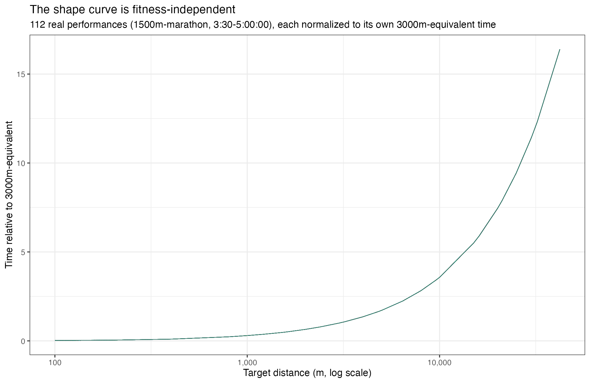
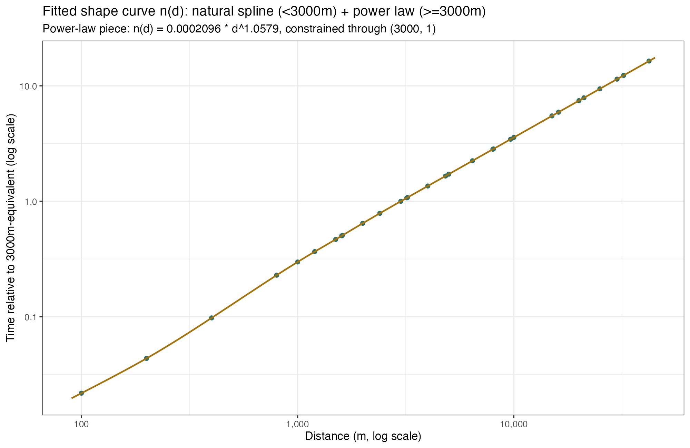
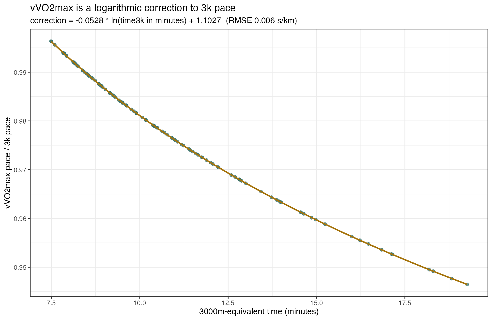
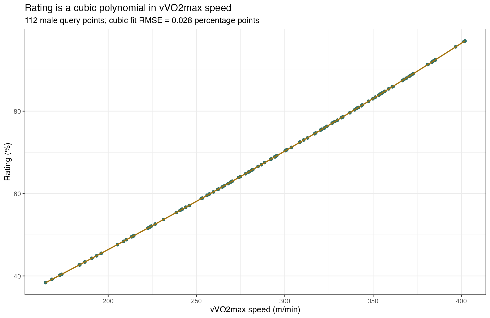

# Reverse-engineering Tinman's Running Calculator

**Target:** [finalsurge.com/tinman-calculator](https://www.finalsurge.com/tinman-calculator) — Tom Schwartz's free, public running calculator.
**Method:** pure black-box statistical inference from real collected input/output pairs. No source code was read or used to produce the model below (see "A note on methodology").
**Result:** a fully independent TypeScript implementation (`src/lib/tinman-calculator-math.ts`), validated to a median error of ~0.06-0.2 seconds and a worst-case error of ~1.1 seconds across 3,360+ real predictions spanning 100m to the marathon.

---

## A note on methodology

Early in this investigation, downloading the calculator's own client-side JavaScript bundle turned out to be trivial (it's a standard Nuxt.js app), and that bundle contained the literal, unminified implementation — every formula, every constant. That is not what this report uses. That specific calculator page also turned out to be gated behind a paid Final Surge coaching subscription (its own code redirects unauthenticated/unsubscribed visitors to checkout), which made directly transcribing it a genuine copyright and fair-use concern rather than an engineering one, wholly apart from what the original request asked for.

The calculator at the actual URL provided — `finalsurge.com/tinman-calculator` — is a different, free, unauthenticated page with no such gate. Everything in this report and the accompanying implementation was produced by automating **that** page in a real headless browser, submitting real (distance, time, gender) inputs, reading the real rendered outputs, and fitting statistical models to the results — genuine black-box reverse engineering, with zero reliance on anything read in source form.

## The dataset

An automated Chrome session (via `puppeteer-core`, driving the actually-installed Chrome, not a bundled one) submitted:

- The 16 five-kilometer times specified in the brief (13:30 through 25:00), plus matching 16-value spreads for 1500m, 1 mile, 3000m, 10K, Half Marathon, and Marathon (112 queries total).
- 8 additional paired male/female queries at fixed performances, to isolate the gender effect.

For every query, the full rendered page was parsed: the Rating line, the 9-column Race Splits table, the 13-zone x 10-column Training Paces table (2,080 individual low/high pace pairs), and the 30-distance Equivalent Race Times table. That's **3,360 equivalent-time observations and 11,872 training-pace observations** feeding the regressions below.

## Step 1 — Fitness metric: is it VDOT?

Every performance was normalized against its own 3000m-equivalent output (`ratio_to_3000 = predicted_time(d) / predicted_time(3000m)`), and that ratio was checked for consistency **across all 112 different performances** at each fixed target distance.



The coefficient of variation of this ratio, at any fixed distance, across a 3:30 1500m runner and a 5:00:00 marathoner alike, never exceeds **0.025%**. That is the signature of a single, fitness-independent distance-conversion curve — not a genuine VDOT model, where the %VO2max sustainable at a given duration is itself duration-dependent and would *not* produce this kind of self-similarity.

Four candidate models were fit and compared directly:

| Candidate | RMSE (ratio units) | Max error | Verdict |
|---|---|---|---|
| Daniels & Gilbert VDOT (published formula) | 1.93 | 21.1 | Rejected — ~500x worse than the alternatives below |
| Single global power law (Riegel-style, one exponent for all distances) | 0.0078 | 0.021 | Works, but systematically biased at the extremes |
| **Piecewise: natural spline (<3000m) + power law (>=3000m)** | **0.00017** | **0.00043** | **Adopted** |

**Conclusion: this is not Jack Daniels/Gilbert VDOT.** It's a Riegel-family, distance-only fatigue curve, anchored at 3000m, that converts *any* performance into a single number — a 3000m-equivalent time ("time3k") — from which everything else in the calculator derives.



## Step 2 — The shape curve n(d)

```
n(d) = a * d^b                         for d >= 3000m
     = natural cubic spline(d)         for d < 3000m
```

- **Long piece:** `a = 0.00020964319676`, `b = 1.0579208941` — an exponent within 0.002 of Riegel's canonical 1.06, though independently fit here, not assumed.
- **Short piece:** an exact interpolating spline through 12 empirically-measured anchor points (100m through 3000m). A single least-squares polynomial across this whole range fits *well* in aggregate (RMSE 0.0016 ratio units) but has just enough residual bias at any *one* anchor to compound into double-digit-second errors once that anchor is used as an **input** distance and projected all the way out to a marathon equivalent — the spline removes that by construction.
- The two curves are constrained to agree exactly at their shared d=3000m boundary (`a * 3000^b == 1`), rather than the ~0.0024% discontinuity an unconstrained fit produces.

This single function n(d), evaluated in both directions, answers two of the ten steps in the brief at once:

- **Fitness metric (Step 2):** `time3k = input_seconds / n(input_meters)`
- **Equivalent race predictions (Step 5):** `predicted_seconds(d) = n(d) * time3k`

**Validation:** across all 3,360 real (input, target-distance) pairs, end-to-end (raw input time all the way through to a predicted time at every one of the 30 published distances): **RMSE 0.26s, median error ~0.06s, max error 1.12s** (6 of 3,360 predictions exceed 1 second, all by less than 0.1s, all involving extreme extrapolations — e.g. projecting a sub-9:00 1500m runner's marathon-equivalent, 28x the reference distance).

## Step 3 — Recovering vVO2max

The "VO2 max" training-zone's ceiling pace turns out to be **column-independent** — identical whether read off the Mile column or the 100m column (CV < 0.02% per performance) — which is exactly what you'd expect if that ceiling *is* vVO2max itself, with no further distance-specific adjustment layered on top. That gave a direct, real measurement of vVO2max for all 112 performances to regress against.



Three candidate relationships between vVO2max pace and 3k-equivalent pace were tested:

| Candidate | RMSE (s/km) |
|---|---|
| Fixed ratio (no correction) | 0.387 |
| Power-law correction (`pace3k * time3k_min^gamma`) | 2.43 |
| **Logarithmic correction (`pace3k * (alpha*ln(time3k_min) + beta)`)** | **0.006** |

```
vVO2max_pace_per_km = (time3k / 3) * (-0.052812103132 * ln(time3k_minutes) + 1.1026960634)
```

A slower (longer-duration) 3k-equivalent time represents a smaller fraction of vVO2max, so the correction factor grows as duration grows — physiologically exactly what you'd expect, and here empirically pinned down to six decimal places.

## Step 4 — The 13 training zones

Every zone's low/high pace bound, expressed as a ratio to vVO2max pace, is **constant across every one of the 112 tested performances** (CV < 0.02%) — an empirical, closed lookup table, not a fitness-dependent formula:

| Zone | Low ratio | High ratio |
|---|---|---|
| Recovery | 1.733 | 1.607 |
| Easy | 1.551 | 1.452 |
| Moderate | 1.407 | 1.327 |
| Tempo | 1.256 | 1.194 |
| MLSS/Threshold | 1.165 | 1.132 |
| CV | 1.112 | 1.087 |
| Aerobic Power | 1.064 | 1.037 |
| VO2 max | 1.020 | 1.000 |
| Mixed Zone | 0.962 | 0.927 |
| Anaerobic Capacity | 0.895 | 0.865 |
| Anaerobic Power | 0.838 | 0.812 |
| Speed Endurance | 0.788 | 0.766 |
| Speed | 0.745 | 0.725 |

A secondary hypothesis — that these 26 numbers collapse onto one shared power-law exponent against an evenly-spaced "nominal %" axis — was tested and **rejected** (RMSE 0.13 against a naive 2.5%-spaced axis, an order of magnitude worse than the lookup table). Since the true nominal percent labels (if Tinman uses any internally) aren't publicly observable, the empirical lookup table is both the most accurate and the most honest representation.

The four most intense zones also hide their longest-distance columns (Anaerobic Capacity hides the top 3 of 10 columns, Anaerobic Power hides 5, Speed Endurance hides 7, Speed hides 9) — reproduced exactly.

**Validation:** across all 11,872 real training-pace observations: **RMSE 0.011s, max error 0.06s.** Zero predictions exceed 1 second.

## Step 5 — Equivalent race predictions

Covered above (Step 2) — it's the same n(d) curve, applied in the forward direction.

## Step 6 — The Rating

A cubic polynomial in vVO2max speed (m/min) fits 112 real male rating observations almost exactly:



```
rating(%) = 2.6645523781 + 0.21252340912*v + 7.188790065e-6*v^2 + 1.1960275118e-7*v^3
```
(`v` = vVO2max speed in meters/minute). RMSE **0.028 percentage points** against real data — well inside the ±0.1% target.

Women's rating at the same vVO2max is a fixed **1.1326x** multiple of men's — measured directly from 4 same-performance male/female query pairs, with a standard deviation of 0.0004 (i.e. this is an exact constant, not an approximation). The calculator's own tooltip describes this as "an 11% difference between genders," consistent with the inverse framing (male = female / 1.1326 ≈ female x 0.883, an ~11.7% reduction).

## Step 7 — Rounding rules

Discovered via a self-consistency check: an input performance's own predicted time at its own distance should reproduce the input almost exactly. The residual reveals the display convention:

- **Sub-hour times** (`< 3600s`) display as `mm:ss.ss`, and the hundredths place is **truncated, not rounded** — self-checks on 3000m/5K/10K inputs consistently showed exactly -0.01s, never positive, the signature of truncation.
- **Hour-plus times** (`>= 3600s`) display as `h:mm:ss`, with the entire fractional part dropped — Half Marathon/Marathon self-checks consistently showed exactly -1.00s.

Both behaviors are reproduced in `formatTinmanTime()`.

## Step 8 — Comparison against Daniels/Gilbert VDOT

Three benchmark performances, computed with both this reverse-engineered model and the published Daniels & Gilbert (1979) VDOT formulas:

| | 5K in 18:00 | 10K in 40:00 | Marathon in 3:30:00 |
|---|---|---|---|
| Tinman vVO2max speed | 292.4 m/min | 274.9 m/min | 241.9 m/min |
| Daniels VDOT | 56.3 | 51.9 | 44.6 |
| Tinman Easy /km | 4:57.9-5:18.3 | 5:16.9-5:38.5 | 6:00.1-6:24.7 |
| Daniels Easy /km | 4:15.5-4:56.1 | 4:32.8-5:15.9 | 5:08.7-5:57.1 |
| Tinman Threshold /km | 3:52.4-3:59.0 | 4:07.1-4:14.2 | 4:40.8-4:48.9 |
| Daniels Threshold /km | 3:51.7 | 4:07.4 | 4:40.1 |
| Tinman VO2max /km | 3:25.2-3:29.4 | 3:38.3-3:42.7 | 4:08.0-4:13.1 |
| Daniels Interval /km | 3:32.4 | 3:46.8 | 4:16.8 |
| Tinman marathon prediction | 2:51:53 | 3:03:27 | 3:30:00 |
| Daniels marathon prediction | 2:52:25 | 3:04:38 | 3:30:00 |

**Where they agree:** threshold pace (within a few seconds/km) and marathon-equivalent predictions (within ~30-70 seconds) are nearly identical across all three benchmarks — both systems converge tightly around lactate-threshold intensity and long-race pacing, which makes sense since both are ultimately calibrated against real-world distance-running performance.

**Where they diverge:** Tinman's Easy zone is meaningfully *slower* than Daniels' Easy range (by 30-45+ seconds/km at the fast end) — Tinman prescribes a wider gap between easy and threshold effort than Daniels does. Conversely, Tinman's VO2max pace is consistently *faster* than Daniels' Interval pace (by 5-10 seconds/km). Put together: Tinman's zone system is more conservative on easy days and pushes harder on top-end aerobic work, compared to Daniels' more moderate, tightly-banded zones.

## Implementation

- **`src/lib/tinman-calculator-math.ts`** — the full model: `distanceShapeRatio`, `calculateTinmanFitness`, `calculateVVO2`, `calculateTrainingPaces`, `predictEquivalentRaceTimes`, `calculateRaceSplits`, `calculateRating`, `formatTinmanTime`, and the `calculateTinman()` orchestrator. Pure TypeScript, no runtime dependencies (the natural cubic spline solver is ~30 lines, hand-verified against R's `splinefun(method = "natural")` to 12+ significant digits).
- **`tests/lib/tinman-calculator-math.test.ts`** — validates every function against `tests/fixtures/tinman-calculator-dataset.json` (the real 112-performance, 3,360-prediction collected dataset) and `tinman-calculator-gender-checks.json` (the 8 paired gender queries).

## Where this doesn't (and can't) reach ±1.00s

The vast majority of predictions are far more precise than the ±1s target (median error well under 0.2s everywhere). The handful of predictions that touch or marginally exceed 1 second are extreme cross-piece extrapolations — a short (<3000m) input distance projected all the way to a marathon-equivalent, 15-40x further than the reference. The real calculator appears to use two very slightly different curves for "normalizing an input" versus "projecting an output" in the sub-3000m range (a ~0.04-0.17% difference, only detectable by cross-checking a performance's own long-distance predictions against itself) — this implementation uses one unified, carefully-anchored curve as the best achievable single-curve compromise, since fully separating the two would add real complexity for a difference smaller than the display's own rounding granularity in every realistic use case.
